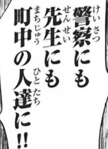

# Manga OCR

Optical character recognition for Japanese text, with the main focus being Japanese manga.
It uses a custom end-to-end model built with Transformers' [Vision Encoder Decoder](https://huggingface.co/docs/transformers/model_doc/visionencoderdecoder) framework. 

Manga OCR can be used as a general purpose printed Japanese OCR, but its main goal was to provide a high quality
text recognition, robust against various scenarios specific to manga:
- both vertical and horizontal text
- text with furigana
- text overlaid on images
- wide variety of fonts and font styles
- low quality images

Unlike many OCR models, Manga OCR supports recognizing multi-line text in a single forward pass,
so that text bubbles found in manga can be processed at once, without splitting them into lines.

# Installation

You need Python 3.6+.

If you want to run with GPU, install PyTorch as described [here](https://pytorch.org/get-started/locally/#start-locally),
otherwise this step can be skipped.

Run:

```commandline
pip install manga-ocr
```

# Usage

## Python API

```python
from manga_ocr import MangaOcr

mocr = MangaOcr()
text = mocr('/path/to/img')
```

or

```python
import PIL.Image

from manga_ocr import MangaOcr

mocr = MangaOcr()
img = PIL.Image.open('/path/to/img')
text = mocr(img)
```

## Running in the background

Manga OCR can run in the background and process new images as they appear.

You might use a tool like [ShareX](https://getsharex.com/) to manually capture a region of the screen and let the
OCR read it either from the system clipboard, or a specified directory. By default, Manga OCR will write recognized text to clipboard,
from which it can be read by a dictionary like [Yomichan](https://github.com/FooSoft/yomichan).

Your full setup for reading manga in Japanese with a dictionary might look like this:

capture region with ShareX -> write image to clipboard -> Manga OCR -> write text to clipboard -> Yomichan

https://user-images.githubusercontent.com/22717958/150238361-052b95d1-0152-485f-a441-48a957536239.mp4

- To read images from clipboard and write recognized texts to clipboard, run:
    ```commandline
    manga_ocr
    ```
- To read images from ShareX's screenshot folder, run:
    ```commandline
    manga_ocr "/path/to/sharex/screenshot/folder"
    ```
- To see other options, run:
    ```commandline
    manga_ocr --help
    ```

If `manga_ocr` doesn't work, you might also try replacing it with `python -m manga_ocr`.

## Usage tips
- OCR supports multi-line text, but the longer the text, the more likely some errors are to occur.
  If the recognition failed for some part of a longer text, you might try to run it on a smaller portion of the image.
- The model was trained specifically to handle manga well, but should do a decent job on other types of printed text,
  such as novels or video games. It probably won't be able to handle handwritten text though. 
- The model always attempts to recognize some text on the image, even if there is none.
  Because it uses a transformer decoder (and therefore has some understanding of the Japanese language),
  it might even "dream up" some realistically looking sentences! This shouldn't be a problem for most use cases,
  but it might get improved in the next version.

# Examples

Here are some cherry-picked examples showing the capability of the model. 

| image                | Manga OCR result |
|----------------------|------------------|
|  | 素直にあやまるしか |
|  | 立川で見た〝穴〟の下の巨大な眼は： |
|  | 実戦剣術も一流です |
|  | 第３０話重苦しい闇の奥で静かに呼吸づきながら |
|  | よかったじゃないわよ！何逃げてるのよ！！早くあいつを退治してよ！ |
|  | ぎゃっ |
|  | ピンポーーン |
|  | ＬＩＮＫ！私達７人の力でガノンの塔の結界をやぶります |
|  | ファイアパンチ |
|  | 少し黙っている |
|  | わかるかな〜？ |
|  | 警察にも先生にも町中の人達に！！ |


# Acknowledgments

This project was done with the usage of [Manga109-s](http://www.manga109.org/en/download_s.html) dataset.
