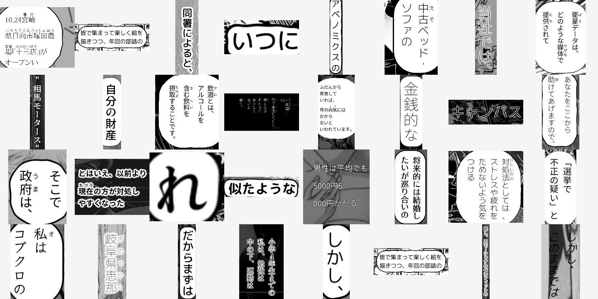
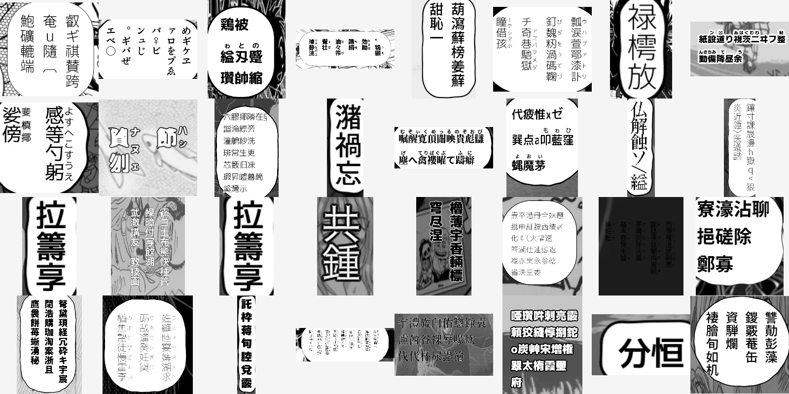

# Synthetic data generator

Generation of synthetic image-text pairs imitating Japanese manga for the purpose of training OCR.

Features:
- using either text from corpus or random text
- text overlaid on background images
- drawing text bubbles
- various fonts and font styles
- variety of text layouts:
  - vertical and horizontal text
  - multi-line text
  - [furigana](https://en.wikipedia.org/wiki/Furigana) (added randomly)
  - [tate chū yoko](https://www.w3.org/International/articles/vertical-text/#tcy)

Text rendering is done with the usage of [html2image](https://github.com/vgalin/html2image),
which is a wrapper around Chrome/Chromium browser's headless mode.
It's not too elegant of a solution, and it is very slow, but it only needs to be run once,
and when parallelized, processing time is manageable (~17 min per 10000 images on a 16-thread machine).

The upside of this approach is that a quite complex problem of typesetting and text rendering
(especially when dealing with both horizontal and vertical text) is offloaded to
the browser engine, keeping the codebase relatively simple and extendable. 

High-level generation pipeline is as follows:
1. Preprocess text (truncate and/or split into lines, add random furigana).
2. Render text on a transparent background, using HTML engine.
3. Select background image from backgrounds dataset.
4. Overlay the text on the background, optionally drawing a bubble around the text.

# Examples

## Images generated with text from [CC-100 Japanese corpus](https://data.statmt.org/cc-100/)

## Images generated with random text
